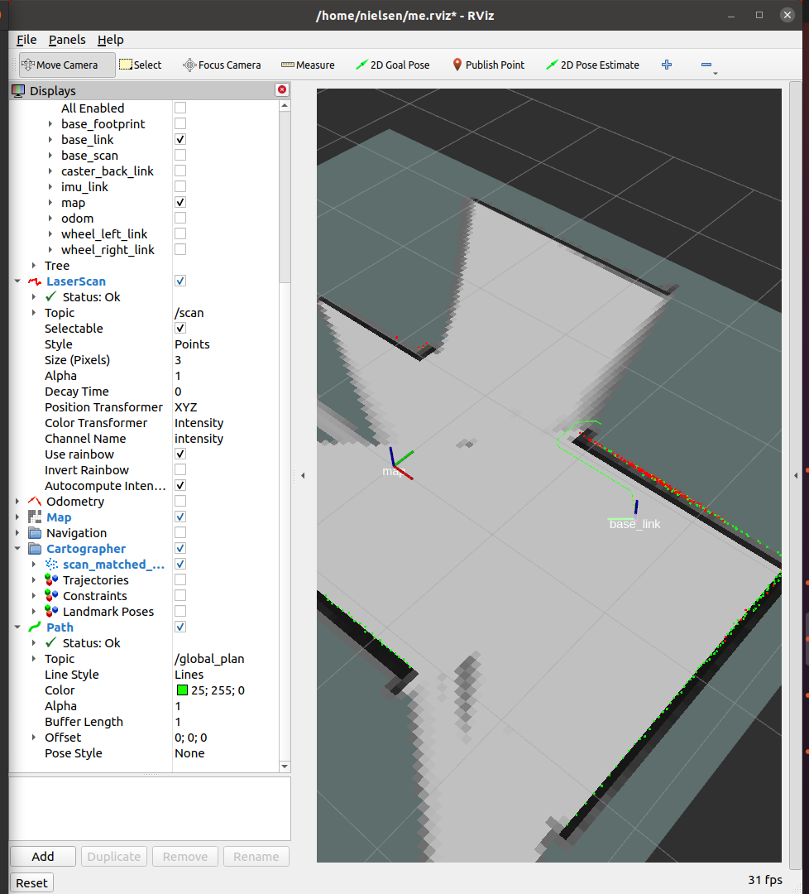

# EG2310 Group 8 Autonomous Navigation Turtlebot With IR Detecting Ping-Pong Cannon

Group 8 has modified the turtlebot to perform autonomous navigation and given an IR target, it will cease autonomous navigation and fire at the target. It will then continue its autonomous navigation.

# Required OS and Packages
1) Ubuntu 20.04.2.0 LTS Desktop (64 bit)
2) ROS 2 Foxy Fitzroy
3) Turtlebot Packages
4) Ubuntu 20.04.1(Focal) Preinstalled Server (for Raspberry Pi)
5) OpenSSH
6) OpenCR Firmware
7) Python IDE

# Installation
The full set-up from scratch is provided in the [Wiki](https://github.com/Nielsencu/r2auto_nav/wiki). We assume that you already have the relevant packages as stated above.

# Overview
Software flow for mapping and firing.

	

## Navigation
For occupancy grid data, -1 value is mapped to 1, and occupancy grid values ranging from 0 to 60 are mapped to 2 and 60 to 100 are mapped to 3.

In this case, 1 is unmapped, 2 is free space, and 3 is blocked.

Map file is also saved under 'occ.txt'.

For navigation, Breadth First search is used to find unmapped areas. Breadth first search starts from robot's current position.

Unmapped area is a 3x3 subarray, as shown below.

	
	
Yellow tiles can be either of value 1 or 2

Once an unmapped area has been found, A* Search is used to find path between robot's current position and the unmapped area.

Turtlebot follows the global path by updating its' path on the fly. It always attempts to go to 1st item in the path, and pops the item if it has reached the coordinate. This will keep continuing until the path is empty. It is like a pacman following a line. If the current path is blocked, it will find another nearest unmapped area and update the current path to a new path to this new unmapped area. If the end goal is no longer unmapped, it will find a new nearest unmapped area and update the current path again.

Mapping is completed when there is no more unblocked and unmapped area.

For visualization purposes, if path is found, it is published to /global_plan topic. One can use Rviz to visualize the path like below.

	

## Identify, Aim, Fire
The IR camera used is an AMG8833, which returns a 8x8 array of data that displays the temperature within its range. After identifying that there is a target within range, the next is to aim. To aim, we selected a few indexes in the 8x8 array, typically the middle rows and top-middle rows, as the most probable chances for the ping pong ball to hit the target if fired. We then integrated it with the stepper motor attached, allowing us to tile the mechanism up and down wherever needed and once it reached our ideal angle, fire away. The Fire script is run, where the firing motor starts its revolutions first followed by a slight delay before the feeder motor begins. After the script ends, navigation continues.

## Navigation and Shooting Integration
If the first threshold temperature is inside the 8x8 array returned by IR camera, RPi will publish a message to r2auto_nav that the target is detected and navigation will be stopped immediately. Following that, RPi will keep publishing messages to r2auto_nav either move forward, left or right until the second threshold temperature is in the middle of the 8x8 array. Once the second threshold is in the middle, it will stop moving and trigger the shooting mechanism. Once it has shot, it will publish one last message to resume navigation and the script will be terminated. Navigation is then resumed as per usual.

# Running navigation and shooting
1. SSH into the Rpi by running `sshrp` (Ensure that you're connected to hotspot that is connected to the RPi).
2. Run `rosbu`.
3. Run `rslam` in a separate terminal to open up Rviz.
4. Open a new terminal and SSH into the RPi again.
5. Copy the shooting scripts, which is in `finalised/`folder to RPi.
6. Once scripts are already transferred to RPi, run `python3 Aimingwifcoms.py` to activate the shooting script.
7. Open up a new terminal and change your directory by running `cd ~/colcon_ws`.
8. Run `colcon build` to apply any changes you've made to the auto_nav package.
9. Run `ros2 run auto_nav r2auto_nav` to start the navigation.
10. Now both navigation and shooting should be running properly.

# Future Improvements
* Global Path Smoothing
* Uses control signal to follow the global path
* Implement obstacle avoidance (Local Planner)
	
	

